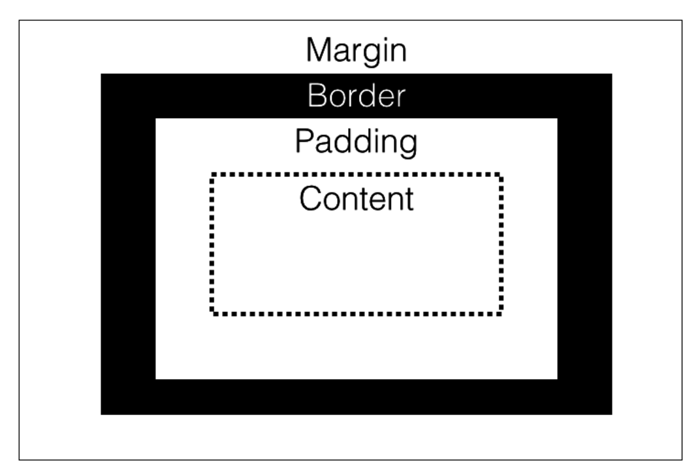
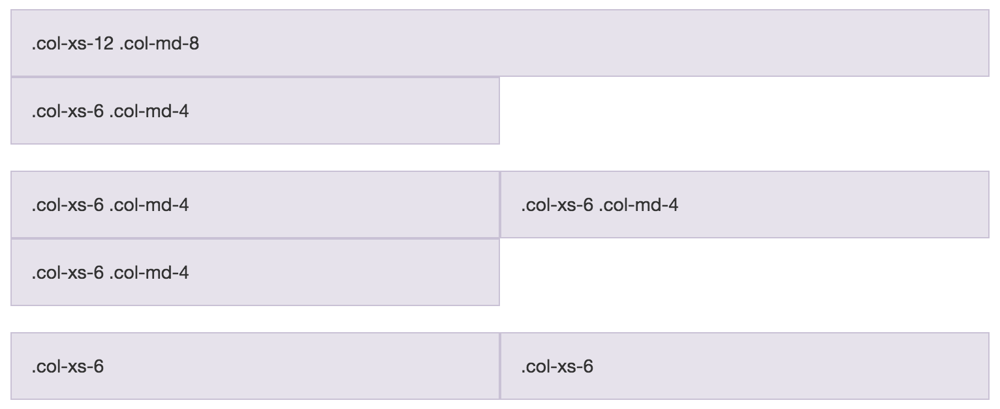
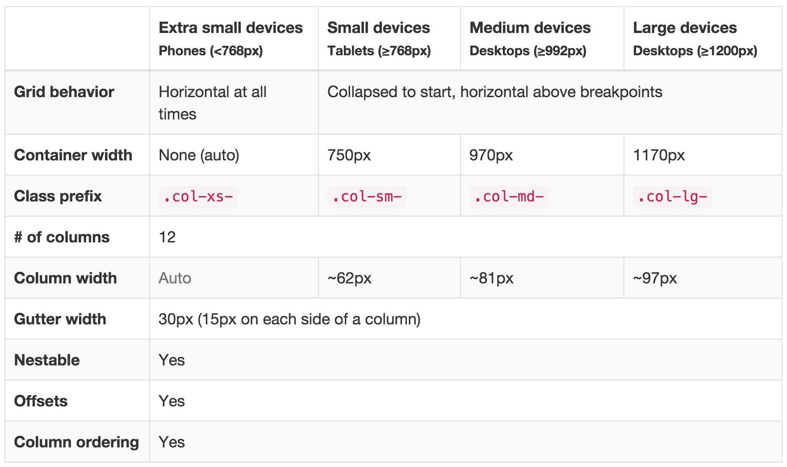

# Module 2: HTML and CSS

## Overview
In this course, we'll be building interactive data visualizations _on the web_.  While there is a pre-requisite of a web-programming course, this module provides a basic review of some foundational concepts.  If you're feeling at all rusty, I **strongly suggest** you fine-tune your HTML and CSS skill before moving forward.  This module will cover the following skills:

- Basic page layout with HTML
- Types of HTML elements
- Using Cascading Style Sheets to add styles to pages
- Introduction of the Grid system with the CSS framework Bootstrap  

## Resources
There are limitless resources on the web regarding web-programming (shocking), but here are a few to get you started:

- [HTML5 General Reference](http://www.w3schools.com/tags/ref_byfunc.asp)
- [HTML Attribute Reference](http://www.w3schools.com/tags/ref_standardattributes.asp)
- [CSS Selector Reference](http://www.w3schools.com/cssref/css_selectors.asp)
- [CSS Properties Reference](http://www.w3schools.com/cssref/default.asp)
- [CSS Units Reference](http://www.w3schools.com/cssref/css_units.asp)
- [Bootstrap Framework](http://getbootstrap.com/)
- [w3shools Bootstrap Tutorial](http://www.w3schools.com/bootstrap/default.asp)
- [Materialize Framework](http://materializecss.com/)
- [Font Awesome icons](https://fortawesome.github.io/Font-Awesome/)
## HTML

**H**yper**T**ext **M**arkup **L**anguage is a programming language for describing how to display web documents.  It uses `<tags>` to mark up plain text, and provide rendering instructions to a web-browser.  Even the most beautiful and complex data visualizations on the web are simply HTML elements arranged into what people perceive as charts, plots, and maps.

In an HTML document, you'll arrange different HTML elements into a tree structure which defines how your page is laid out.  For example, if you wanted two paragraph elements (`<p>`) inside of a division (`<div>`) or your page, it would look like this:

```html
<div>
  <p>This is the first paragraph</p>
  <p>This is the second paragraph</p>
</div>
```

The visual element that you want to render fall in the `<body>` section of your page.  You may want to read in other files, or set certain properties of you page, which would happen in the `<head>` section of your `.html` file.  Here is an example file:

```html
<!-- This is a comment: your browser will not interpret it -->
<!-- Declare the document type -->
<!DOCTYPE html>

<!-- Start the html section of the document -->
<html>

  <!-- Head section: set meta properties, read in files -->
  <head>
  <!-- Set the page title -->
  <title>Page Title</title>

  <!-- Read in the D3 library -->
  <script type="text/javascript" src="http://d3js.org/d3.v3.min.js"></script>

  <!-- Read in the bootstrap CSS file -->
  <link href="https://maxcdn.bootstrapcdn.com/bootstrap/3.3.5/css/bootstrap.min.css" rel="stylesheet" type="text/css" />


  </head>

  <!-- Body section: render content -->
  <body>
    <h1>My First Heading</h1>
    <p>My first paragraph.</p>
  </body>
</html>
```

In order to render visual tags such as `circle` or `rect` elements, we'll need to wrap them in a **Scalable Vector Graphic** tag (`<svg>`).  For example, you could render a circle:

```html
<!-- Create an svg element -->
<svg width="100" height="100">

  <!-- Render a circle element -->
  <circle cx="50" cy="50" r="40" stroke="green" stroke-width="4" fill="yellow" />
</svg>
```

## CSS

**C**ascading **S**tyle **S**heets provide you with a syntax for manipulating the styles with which HTML elements are rendered.  For example, you may want to specify the color, background-color, font-size, or font-face of an element.  As a best practice, CSS styles should be written in a separate `.css` file and read into your `.html` file in the `<head>` section of a document:
```html
<!DOCTYPE html>
<html>
  <head>
  <!-- Read in a local CSS file -->
  <link href="css/main.css" rel="stylesheet" type="text/css" />
  </head>
</html>
```

In your CSS file, you'll apply a variety of styles to selected elements (more on this below).  Each style that you wish to apply will be written as a `property:value` pair, where the **property** is the style you wish to manipulate (i.e., color) and the value is the specific value you wish to apply (i.e., blue).  Here is some css pseudo-code:

```css
selector1 {
  property:value;
  property-2:value2;
}

selector2 {
  property:value;
  property2:value2;
}
```

### Selectors
In order to apply a style to an element, you must **select** that element on the page. This is a common task in web-development, and multiple libraries (`d3` and `jquery` included), follow these conventions.  Here are some basic ways in which you can select elements (way [more](http://www.w3schools.com/cssref/css_selectors.asp)):

| Syntax  | Example | Selection |
| ------------- | ------------- | ------------- |
| `#element-id` | `#my-chart` | Select the element with id `my-chart` |
| `.class-name` | `.axis` | Selects **all** elements with class `axis`|
| `element-type`| `p` | Selects **all** paragraph (`<p>`) elements |
| `:hover`| `a:hover` | Selects **all** links that are being hovered over |
| `element-type element-type`| `svg g` | Selects **all** `<g>` elements **inside of** `<svg>` elements |

### Arranging elements
Elements naturally arrange themselves on the page based on the size of the elements, and if they naturally align with other elements.  

>**Block level elements**: take up 100% of the width, and will not be in the same horizontal alignment as other elements.  Examples include `<div>`, `<h1>` - `<h6>`, and `<form>`.

>**Inline level elements**: only take up as much width as their contents, and will share a horizontal position with other elements if they fit within the width of the page.  Examples include `<svg>`, `<a>`, and `<span>`.

>**Inline-block elements**: permit multiple elements to align horizontally (like inline), while allowing you to set a desired width and height (like block).

** Note **: You can change the default `display` property of any element to assign it the characteristics you desire.  However, these defaults are specified for a reason -- rather than change the `display` property, you may want to choose another type of element.

The amount of space taken up by each element is best explained by the [box-model](http://www.w3schools.com/css/css_boxmodel.asp).  Think of each HTML element as some content in a box.  The amount of space occupied by that box depends on:

- The amount of space between the content and the outsize of the box (`padding`)
- The thickness of the box (`border`)
- The desired distance between the box and other boxes (`margin`)

Manipulating these properties allows you to specify how your content should be arranged on the page:




### Frameworks
Even for basic tasks, it makes sense to use a CSS framework to structure your code.  A CSS framework is a pre-written set of CSS files that apply styles to your elements.  They are particularly useful for making sites responsive based on screensize.  The most popular CSS framework on the web is [Bootstrap](http://getbootstrap.com/), which was developed by Twitter.  However, [Materialize](http://materializecss.com/) (by Google) appears to be gaining traction, and is a nice break from the ubiquity of default Bootstrap styles (you'll start to notice them everywhere once you use them).  To use a CSS framework, you simply read the file(s) into the `head` section of your `.html` file.  Note, some frameworks leverage `JavaScript` files for more advanced interactivity -- these are only required for certain elements (such as modals, which are like fancy dialog boxes) to render properly:

```html
<head>
  <!-- Compiled and minified CSS -->
  <link rel="stylesheet" href="https://cdnjs.cloudflare.com/ajax/libs/materialize/0.97.5/css/materialize.min.css">

  <!-- Compiled and minified JavaScript -->
  <script src="https://cdnjs.cloudflare.com/ajax/libs/materialize/0.97.5/js/materialize.min.js"></script>
</head>
```

It would be a mistake to make common HTML elements (forms, buttons, navigation bars, etc.) without using a framework for applying modern styles.  

The real power of frameworks is in their **responsive design**.  These are made possible by CSS media queries which act as conditional styles based on screensize:
```css
/* Styles to be applied to screens 300px or smaller */
@media screen and (max-width: 300px) {
    body {
        background-color: lightblue;
    }
}
```

### The Grid
While you can write media queries yourself, it is much more powerful to leverage the pre-defined styles that are written in the CSS files of your framework. Both bootstrap and materialize operate in a grid system to arrange elements on the screen.  The premise is that any screen is 12 columns wide, and depending on the width of the screen, you can define how many columns an element occupies.  This example from w3schools shows spans taking up multiple widths:



Here is the table from bootstrap which specifies the pixels associated with each class:



For example, a div with class `.col-md-6` would take up 6 columns on a medium size screen.
