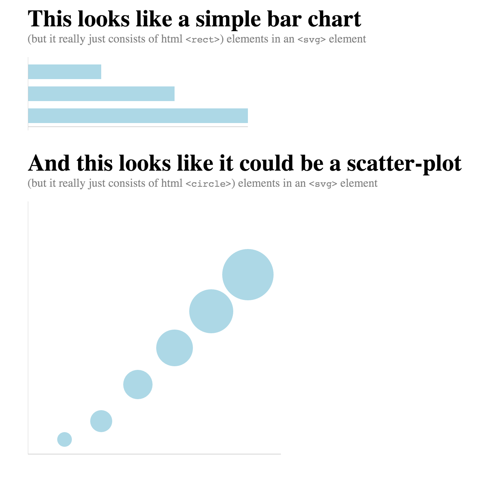

## Exercise 1: Basic HTML review

This is a short exercise to practice basic HTML and CSS syntax.  It is also designed to demonstrate that something that _looks like_ a chart on a website is actually just a collection of simple HTML elements.  As described in [module-1](https://github.com/INFO-474/m1-terminal-and-git#github), start by forking and cloning this repository.  Then, edit the `index.html` and `css/main.css` files to create a page that looks like this:  

Note, we aren't using data to encode these visual properties -- we're just manually setting the attributes of these elements. You may find the following resources helpful:

- [SVG line element](https://www.w3schools.com/graphics/svg_line.asp)
- [SVG circle element](https://www.w3schools.com/graphics/svg_circle.asp)
- [SVG rect element](https://www.w3schools.com/graphics/svg_rect.asp)
- [The box-model](http://www.w3schools.com/css/css_boxmodel.asp)

See the `complete` branch for answers.
