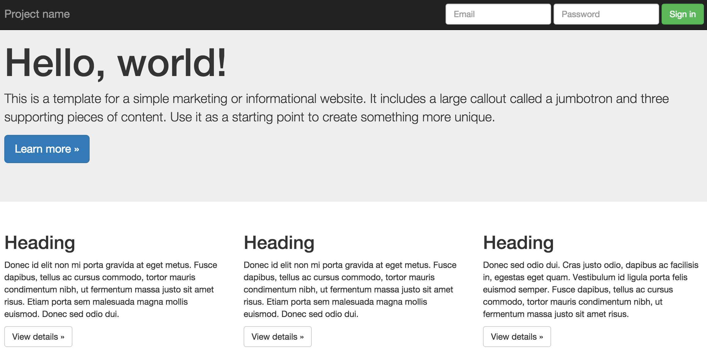
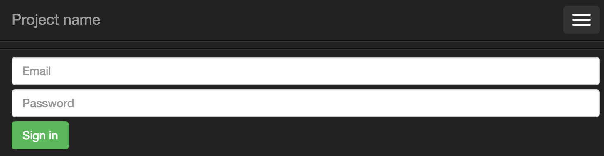
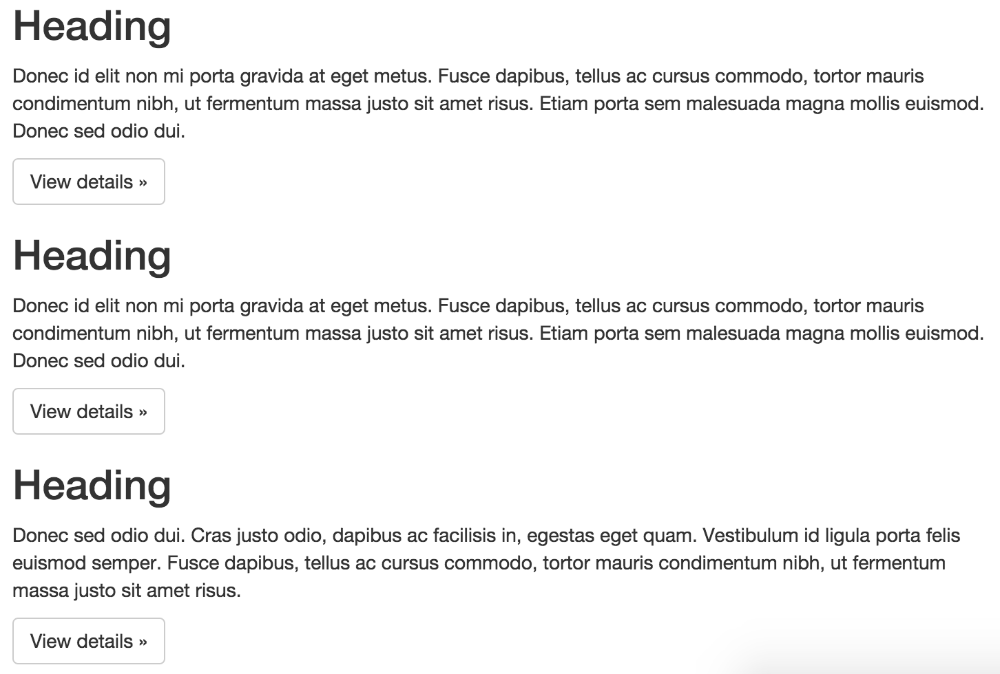

## Exercise 2: Bootstrap
In this exercise, you'll practice leveraging common Bootstrap classes to build a mobile-first website. Because web-programming is a prerequisite to this course, we will not covering how to use these elements in great detail in class.  At this point, you should feel comfortable building modern looking mobile-first websites.   Here is what you are aiming for (desktop):

On a mobile view, the navigation bar should collapse to a standard hamburger menu view that presents options that drop down:

Also on a small screen, the body of the page (three columns of content) should each take up 100% of the width:

Here are some helpful links for this exercise:

- Navigation bar [docs](https://getbootstrap.com/components/#navbar)
- Jumbotron [docs](https://getbootstrap.com/components/#jumbotron)
- Button [components](https://getbootstrap.com/components/#btn-groups)
- Bootstrap form [tutorial](http://www.w3schools.com/bootstrap/bootstrap_forms.asp) (_w3schools_)
- Boostrap grid [example](https://getbootstrap.com/examples/grid/)
